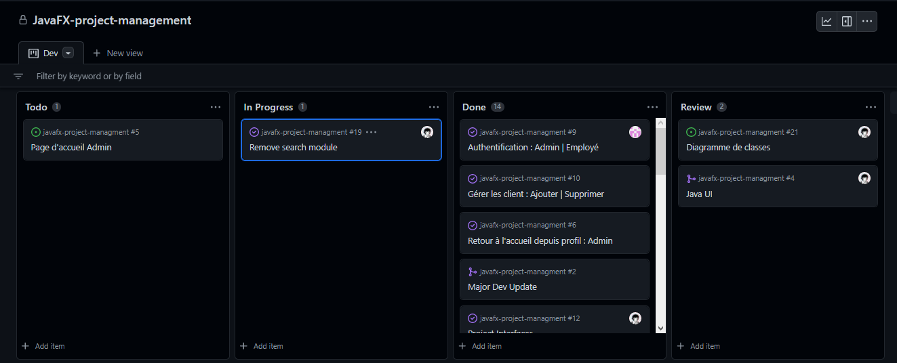

# Gestion des projets : JavaFX

## Diagramme de cas d'utilisation de l'application de gestion de projet

### Description du diagramme de cas d'utilisation
Le diagramme de cas d'utilisation décrit les fonctionnalités de l'application de gestion de projet. Il est composé de 2 acteurs : l'administrateur et l'employé.
#### Acteurs
* Administrateur
* Employé
#### Cas d'utilisation
* Ajouter un utilisateur
* Supprimer un utilisateur
* Modifier un utilisateur
* Consulter un utilisateur
* Ajouter un projet
* Supprimer un projet
* Modifier un projet
* Consulter un projet
* Ajouter une tâche
* Supprimer une tâche
* Modifier une tâche
* Consulter une tâche
* Modifier ses informations personnelles
* s'authentifier
* se déconnecter

## Diagramme de classes de l'application de gestion de projet
.svg)

### Définition des classes
Classes principales :
- `Project_info` : représente un projet
- `Project_task` : représente une tâche qui dépend d'un projet et attribuée à un employé
- `Employee` : représente un employé
- `Client` : représente un client

Classes secondaires :
- `Admin` : représente un administrateur
- `Employee_auth` : représente un utilisateur de l'application
- `Admin_auth` : représente un administrateur de l'application

### Définition des relations
- `Project_info` : 1 - N - `Project_task`
- `Project_task` : 1 - N - `Employee`
- `Client` : 1 - N - `Project_info`
- `Employee` : 1 - N - `Project_task`
- `Admin` : 1 - N - `Admin_auth`

- `Employee` : 1 - 1 - `Employee_auth` 
- `Admin` : 1 - 1 - `Admin_auth`
  _(la séparation entre les deux classes est faite pour éviter de stocker le mot de passe en clair dans la base de données. On pourra le crypter par la suite.)_

### Définition des attributs
`Project_info` : `id`, `project_name`, `start_date`, `end_date`, `estimated_time`, `client_id`
- `id` : identifiant unique du projet
- `project_name` : nom du projet
- `start_date` : date de début du projet
- `end_date` : date de fin du projet 
- `estimated_time` : temps estimé pour le projet (en jours)
- `client_id` : identifiant du client qui a commandé le projet

`Project_task` : `id`,`task_name`,`task_time`, `task_start_date`,`task_end_date`, `progress`, `color`, `progress`, `dependancy`, `assigned`
- `id` : identifiant unique de la tâche
- `task_name` : nom de la tâche
- `task_time` : temps estimé pour la tâche (en jours)
- `task_start_date` : date de début de la tâche
- `task_end_date` : date de fin de la tâche
- `progress` : pourcentage de progression de la tâche
- `color` : couleur de la tâche (pour représenter le pourcentage de progression dans le diagramme de Gantt)
- `dependancy` : identifiant de la tâche dont dépend la tâche
- `assigned` : identifiant de l'employé qui est attribué à la tâche

`Employee` : `id`, `name`, `designation`, `department`, `contact`, `email`, `gender`
- `id` : identifiant unique de l'employé
- `name` : nom de l'employé
- `designation` : poste occupé par l'employé
- `department` : département de l'employé
- `contact` : numéro de téléphone de l'employé
- `email` : adresse mail de l'employé
- `gender` : sexe de l'employé (Male, Female)

`Client` : `id`, `name`, `contact_person`, `phone`, `address`
- `id` : identifiant unique du client
- `name` : nom du client (ou raison sociale)
- `contact_person` : nom de la personne de contact
- `phone` : numéro de téléphone du client
- `address` : adresse du client

## Diagramme de séquence de l'application de gestion de projet

### Définition des séquences
- `Login` : permet à un utilisateur de se connecter à l'application
- `Logout` : permet à un utilisateur de se déconnecter de l'application
- `Add project` : permet à un administrateur d'ajouter un projet
- `Add task` : permet à un administrateur d'ajouter une tâche
- `Add employee` : permet à un administrateur d'ajouter un employé
- `Add client` : permet à un administrateur d'ajouter un client
- `Delete project` : permet à un administrateur de supprimer un projet
- `Delete task` : permet à un administrateur de supprimer une tâche
- `Delete employee` : permet à un administrateur de supprimer un employé
- `Delete client` : permet à un administrateur de supprimer un client
- `Update project` : permet à un administrateur de modifier un projet
- `Update task` : permet à un administrateur de modifier une tâche
- `Update employee` : permet à un administrateur de modifier un employé
- `Update client` : permet à un administrateur de modifier un client
- `View project` : permet à un administrateur de visualiser un projet
- `View task` : permet à un administrateur de visualiser une tâche
- `View employee` : permet à un administrateur de visualiser un employé
- `View client` : permet à un administrateur de visualiser un client
- `View all projects` : permet à un administrateur de visualiser tous les projets
- `View all tasks` : permet à un administrateur de visualiser toutes les tâches
- `View all employees` : permet à un administrateur de visualiser tous les employés
- `View all clients` : permet à un administrateur de visualiser tous les clients

## Méthode de développement : Kanban

### Définition des colonnes
- `To do` : tâches à faire
- `In progress` : tâches en cours
- `Done` : tâches terminées
- `Review` : tâches à vérifier
### Choix de la méthode
La méthode Kanban a été choisie pour le développement de l'application, car elle permet de visualiser les tâches à faire, en cours et terminées. Elle permet également de suivre l'avancement du projet et de s'organiser. Elle est donc adaptée à notre projet.
Cette méthode a été très optimale pour 3 raisons principales :
- Taille du projet : le projet est assez petit et ne comporte pas beaucoup de tâches.
- Equipe de travail : le projet est développé par deux personnes.
- Durée du projet : le projet est développé en 2 semaines.

